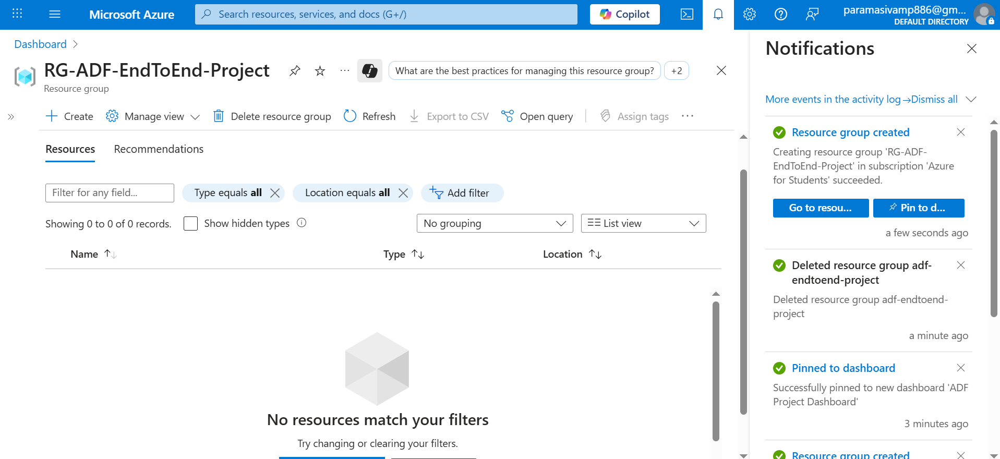
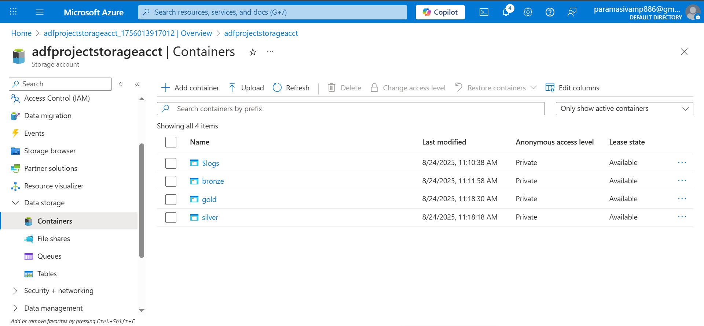

# Azure Data Factory End-to-End Project
---
This repository documents the implementation of a comprehensive **Azure Data Factory (ADF) project** based on real-world industry scenarios.  
The project demonstrates both fundamental and advanced ADF capabilities, covering ingestion, orchestration, monitoring, and transformation using medallion architecture.  

---

## 📌 Project Objectives
- Implement core ADF concepts: **Linked Services, Datasets, Pipelines, Integration Runtimes, Data Flows, and Triggers**.  
- Perform data ingestion and migration tasks including **on-premises to cloud migration, API-based ingestion, and SQL to Data Lake transfers**.  
- Build and operationalize an end-to-end **Medallion Architecture (Bronze → Silver → Gold)**.  
- Apply DevOps practices through **GitHub integration, version control, and CI/CD**.  
- Document progress, errors, and solutions in a transparent manner.  

---

## 🛠️ Technology Stack
- **Azure Data Factory** – Data orchestration and ETL/ELT pipelines  
- **Azure Storage (Blob and Data Lake Gen2 with HNS)** – Storage and data lake layers  
- **Azure SQL Database** – Source/target system for relational data  
- **Self-Hosted Integration Runtime (SHIR)** – On-premises and private network connectivity  
- **Logic Apps** – Failure alerts and notifications  
- **Delta Lake** – Modern data management and incremental processing  
- **GitHub** – Version control and documentation  

---

## Azure Environment Setup

### Quick Navigation
- [1. Create Azure Account](#1-create-azure-account)  
- [2. Provision Azure Data Factory Instance](#2-provision-azure-data-factory-instance)  
- [3. Create Storage Account](#3-create-storage-account)  
- [4. Configure Integration Runtimes](#4-configure-integration-runtimes)  
  - [4.1 Azure IR (cloud-to-cloud)](#41-azure-ir-cloud-to-cloud)  
  - [4.2 Self-Hosted IR (on-premises)](#42-self-hosted-ir-on-premises)  
- [5. Define Linked Services](#5-define-linked-services)  
  - [5.1 Blob / Data Lake Storage](#51-blob--data-lake-storage)  
  - [5.2 On-Premises SQL Database](#52-on-premises-sql-database)  
  - [5.3 REST API (GitHub)](#53-rest-api-github)  
- [6. Create Datasets](#6-create-datasets)  
- [7. Design Pipelines](#7-design-pipelines)  
  - [7.1 On-premises files → Blob](#71-on-premises-files--blob-migration)  
  - [7.2 SQL → Data Lake](#72-sql--data-lake-migration)  
  - [7.3 REST API ingestion](#73-rest-api-ingestion)  
- [8. Implement Incremental Loading](#8-implement-incremental-loading)  
- [9. Configure Error Handling & Retry Policies](#9-configure-error-handling--retry-policies)  
- [10. Build Medallion Architecture](#10-build-medallion-architecture-bronze-silver-gold)  
- [11. Implement Scheduling with Triggers](#11-implement-scheduling-with-triggers)  
- [12. Monitoring & Alerts (Logic Apps)](#12-monitoring--alerts-logic-apps)  
- [13. Data Flows for Transformations](#13-data-flows-for-transformations)  
- [14. Gold Layer Business Views](#14-gold-layer-business-views)  
- [15. GitHub Integration & ARM Templates](#15-github-integration--arm-templates)  
- [16. CI/CD Workflows](#16-cicd-workflows)  

---

### 1. Create Azure Account
- Sign up for an [Azure Free Account](https://azure.microsoft.com/free/).  
- Free account includes **£150 (~$200) credits for 30 days**.  
- Pay-as-you-go option available (~£1–2/month for practice).  
- Requires Microsoft/Outlook account and card verification.  
- Once set up, log in at [Azure Portal](https://portal.azure.com).   

---

### 2. Provision Azure Data Factory Instance
- In your **Resource Group**, click **+ Create Resource** → Search **Azure Data Factory**.
  
- Provide details:  
  - **Name**: must be unique (e.g., `adf-endtoend-2025`)  
  - **Region**: same as Resource Group   
- Click **Review + Create → Create**.  

  
📷 *ADF Creation Form in Portal*  

---

### 3. Create Storage Account
- Go to your **Resource Group** → **+ Create Resource** → search **Storage Account**.  
- Provide details:  
  - **Name**: must be unique (e.g., `adfprojectstorageacct`)  
  - **Region**: same as your ADF instance  
  - **Performance**: Standard  
  - **Replication**: LRS (Locally-redundant)  
- On **Advanced tab**, enable **Hierarchical Namespace** ✅ (required for Data Lake Gen2).  
- Leave other options at default unless needed.  
- Click **Review + Create → Create**.  

Once deployed:
- Go to **Storage Account → Containers → + Container**.  
- Create logical zones like:  
  - `bronze` → raw data  
  - `silver` → cleaned data  
  - `gold` → curated data  

  
📷 *Storage Account Containers*  

---

### 4. Configure Integration Runtimes

#### 4.1 Azure IR (cloud-to-cloud)  
- Default runtime, managed by Microsoft.  
- No setup required, works for all **Azure-to-Azure data movement**.  

#### 4.2 Self-Hosted IR (on-premises)  
- Required for **on-premises to Azure** data transfer.  
- Install SHIR on a local/VM machine.  
- Register it in ADF → **Manage → Integration Runtimes → New → Self-Hosted**.  

📷 *Image Placeholder: SHIR Installation Wizard*  

---

### 5. Define Linked Services  

#### 5.1 Blob / Data Lake Storage  
- Go to **Manage → Linked Services → New**.  
- Select **Azure Blob Storage** or **ADLS Gen2**.  
- Authenticate with **Account Key / Managed Identity**.  

#### 5.2 On-Premises SQL Database  
- Use **Self-Hosted IR**.  
- Provide **SQL Server details, credentials**.  
- Test connection to validate.  

#### 5.3 REST API (GitHub)  
- Use **HTTP Linked Service**.  
- Configure **Base URL** for GitHub API.  
- Authentication: **Anonymous / Basic / OAuth2** (depending on use case).  

📷 *Image Placeholder: Linked Services Setup Page*  

---

### 6. Create Datasets
- Datasets represent **specific data points** (files, tables, APIs).  
- Examples:  
  - Blob CSV file  
  - SQL Table (`SalesOrders`)  
  - GitHub REST JSON response  

---

### 7. Design Pipelines  

#### 7.1 On-premises files → Blob Migration  
- Copy Activity: File System (SHIR) → Blob Storage.  

#### 7.2 SQL → Data Lake Migration  
- Copy Activity: SQL Dataset → ADLS Gen2 Dataset.  

#### 7.3 REST API Ingestion  
- Web Activity → Call API  
- Copy Activity → API response → Data Lake  

📷 *Image Placeholder: Pipeline Canvas with Copy Activity*  

---

### 8. Implement Incremental Loading  
- Use **Monitor folder** in Data Lake with empty JSON tracking last load date.  
- Compare last load date with source.  
- Ingest only new/updated records.  

---

### 9. Configure Error Handling & Retry Policies  
- Enable **Retry Policies** in Copy Activities.  
- Use **On Failure → Execute pipeline** for alerts.  
- Log errors in **Error Lake folder**.  

---

### 10. Build Medallion Architecture (Bronze, Silver, Gold)  
- **Bronze**: Raw ingested data.  
- **Silver**: Cleaned/validated data.  
- **Gold**: Aggregated, business-ready views.  

📷 *Image Placeholder: Medallion Architecture Diagram*  

---

### 11. Implement Scheduling with Triggers  
- Types of triggers: **Schedule, Tumbling Window, Event-based**.  
- Example: Daily schedule trigger for ETL pipelines.  

---

### 12. Monitoring & Alerts (Logic Apps)  
- Integrate ADF with **Logic Apps**.  
- Logic App → Send Email/Teams alert on pipeline failure.  

---

### 13. Data Flows for Transformations  
- Use **Mapping Data Flows** (Spark behind the scenes).  
- Transformations: Derived Column, Select, Filter, Join, Cast.  
- Delta Lake Upsert (Merge/Update).  

---

### 14. Gold Layer Business Views  
- Use Data Flows with **aggregations, joins, window functions**.  
- Example: Airline sales → Top-performing airlines by region.  

---

### 15. GitHub Integration & ARM Templates  
- Link ADF with **GitHub repo**.  
- Publish branch → `adf_publish` (stores ARM templates).  

---

### 16. CI/CD Workflows  
- Use **GitHub Actions / Azure DevOps**.  
- Deploy ARM templates → QA → Prod.  
- Automates promotion of pipelines across environments.  

---
