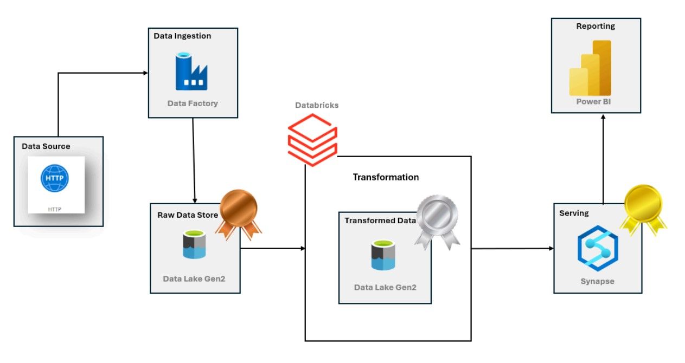
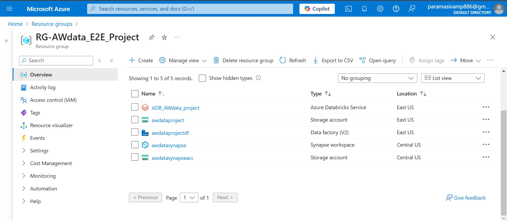
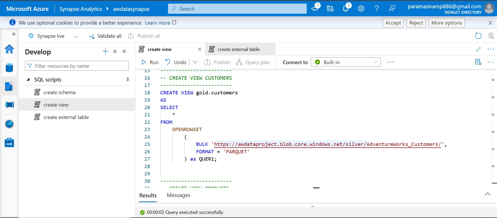

# Building an End-to-End Data Engineering Project with Azure

**Author**: Paramasivam J  

Microsoft Certified Fabric Analytics Engineer 

**Published on**: December 9, 2024

## Overview
In this project, I built an end-to-end (E2E) data engineering solution leveraging Azure's data engineering tools. The solution processes, transforms, and delivers data for Business Intelligence (BI) use. Key Azure resources include:

- **Azure Data Factory (ADF)**: Orchestrates data movement and transformation.
- **Azure Storage Accounts**: Stores raw, transformed, and curated data.
- **Azure Databricks**: Handles data transformations and computations.
- **Azure Synapse Analytics**: Serves as the data warehouse for BI.

The data source used is the AdventureWorks dataset, fetched directly from this GitHub repository. Below, I outline the architecture and detailed steps involved in building this solution.

---

## Architecture

### Step 1: Setting Up the Azure Environment

1. **Azure Data Factory (ADF)**: For orchestration and automation.
2. **Azure Storage Account**: As a data lake with bronze, silver, and gold containers.
3. **Azure Databricks**: For large-scale data transformations.
4. **Azure Synapse Analytics**: For data warehousing and BI integration.

All resources were configured via the Azure portal with proper IAM roles and access policies.

---

### Step 2: Implementing a Robust Data Pipeline Using Azure Data Factory

#### Dynamic Copy Activity
- **Objective**: Ingest data from GitHub and store it in the bronze container.
- **Steps**:
  - Created a HTTP Linked Service for GitHub in ADF.
  - Configured a Copy Activity to pull data using HTTP connectors.
  - Parameterized the pipeline to handle dataset/source changes dynamically.

This ensured raw data was accessible for further processing.

---

### Step 3: Transformation with Azure Databricks

1. **Cluster Setup and Connections**:
   - Created a Databricks cluster.
   - Connected Databricks to the Azure Data Lake.

2. **Data Transformation**:
   - **Date Normalization**: Standardized date formats.
   - **Data Cleansing**: Removed invalid/incomplete records.
   - **Column Operations**: Concatenated and grouped columns for usability.
   - **Parquet Format**: Stored transformed data in the silver container.

This step ensured the data was clean, structured, and analysis-ready.

---

### Step 4: Data Warehousing with Azure Synapse Analytics

1. **Connection and IAM Setup**:
   - Connected Synapse to the storage account.
   - Configured IAM roles for secure access.

2. **Serverless Pools and SQL Database**:
   - Created a serverless SQL pool for querying data.
   - Built a SQL database for schema, views, and queries.

3. **Schema and External Tables**:
   - Defined external tables pointing to the silver container.
   - Created views for BI reporting.

Data was moved to the gold container for final BI consumption.

---

### Step 5: Business Intelligence Integration

- Connected Azure Synapse Analytics to **Power BI**.
- Built dashboards to visualize insights from the gold container data.

---

## Conclusion

This project demonstrates how Azure services can be integrated to build scalable and automated data engineering solutions. The architecture efficiently handles large-scale data transformations and delivers actionable insights to business users.

Key Azure tools:
- **Azure Data Factory** for orchestration.
- **Azure Databricks** for transformation.
- **Azure Synapse Analytics** for warehousing.
- **Power BI** for reporting.

This E2E solution exemplifies the power and flexibility of Azure for modern data-driven businesses.

---

## Connect with Me

- **[LinkedIn](https://www.linkedin.com/in/paramasivam-j-386628270/)**

---

Feel free to leave a comment or suggest improvements!
